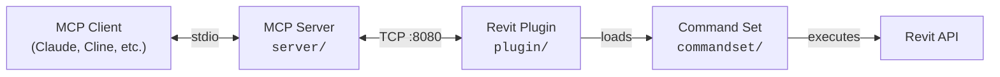

> Questa è la versione italiana del README. For the English version, see [README.md](README.md).

[](https://github.com/mcp-servers-for-revit/mcp-servers-for-revit)

# mcp-servers-for-revit

**Collega assistenti AI ad Autodesk Revit tramite il Model Context Protocol.**

---

mcp-servers-for-revit permette a client AI come Claude, Cline e altri strumenti compatibili MCP di leggere, creare, modificare e cancellare elementi nei progetti Revit in tempo reale. Espone oltre 80 tool che coprono informazioni di progetto, analisi del modello, creazione di elementi, operazioni batch, esportazione dati e altro.

> [!NOTE]
> Basato su [revit-mcp](https://github.com/romanzarkhin/revit-mcp) di Roman Zarkhin (concept originale con 15 tool), ampliato a oltre 80 tool dalla community [mcp-servers-for-revit](https://github.com/mcp-servers-for-revit), e consolidato in un unico repo da [sparx-fire](https://sparx-fire.com) (Bobby Galli). Le aggiunte principali includono funzionamento indipendente dalla lingua, un pannello chat Claude integrato e un installer PowerShell.

## Funzionalita principali

- **Oltre 80 tool MCP** — info progetto, salute del modello, rilevamento interferenze, CRUD elementi, operazioni batch, export dati (PDF/DWG/IFC/CSV)
- **Revit 2023, 2024, 2025, 2026** — completamente testato su tutte e quattro le versioni
- **Indipendente dalla lingua** — funziona con qualsiasi lingua dell'interfaccia Revit (inglese, italiano, francese, tedesco, ecc.) usando la risoluzione BuiltInCategory
- **Pannello chat Claude integrato** — pannello agganciabile all'interno di Revit con accesso diretto all'AI (API Anthropic, extended thinking abilitato)
- **Esecuzione in tempo reale** — le richieste AI vengono eseguite immediatamente sul modello attivo via TCP/JSON-RPC 2.0
- **Command set estensibile** — aggiungi nuovi comandi senza modificare il core del plugin

## Architettura



| Componente | Linguaggio | Ruolo |
|------------|------------|-------|
| **MCP Server** (`server/`) | TypeScript | Traduce le chiamate AI in messaggi JSON-RPC su TCP |
| **Revit Plugin** (`plugin/`) | C# | Eseguito dentro Revit, ascolta su `localhost:8080`, smista i comandi |
| **Command Set** (`commandset/`) | C# | Implementa le operazioni Revit API, restituisce risultati strutturati |

## Requisiti

### Per l'utilizzo

| Requisito | Dettagli |
|-----------|----------|
| **Node.js** | 18+ (per il server MCP) |
| **Autodesk Revit** | 2023, 2024, 2025 o 2026 |
| **OS** | Windows 10/11 (Revit funziona solo su Windows) |
| **Chiave API Anthropic** (opzionale) | Necessaria solo per il pannello chat integrato. Impostabile via `%USERPROFILE%\.claude\api_key.txt` o variabile d'ambiente `ANTHROPIC_API_KEY` |

### Per compilare da sorgente

| Requisito | Dettagli |
|-----------|----------|
| **Visual Studio 2022** | Con workload sviluppo desktop .NET |
| **.NET Framework 4.8 SDK** | Per le build Revit 2023-2024 |
| **.NET 8 SDK** | Per le build Revit 2025-2026 |
| **Node.js 18+** | Per il server MCP |
| **Assembly Revit API** | Installati con Revit (referenziati automaticamente via NuGet) |

## Avvio rapido

### 1. Installa il plugin Revit

#### Opzione A: Installazione automatica (consigliata)

Apri PowerShell e incolla questo comando:

```powershell
powershell -ExecutionPolicy Bypass -Command "irm https://raw.githubusercontent.com/mcp-servers-for-revit/mcp-servers-for-revit/main/scripts/install.ps1 | iex"
```

Lo script:
- Rileva automaticamente le versioni di Revit installate
- Scarica la Release precompilata corretta da GitHub
- Estrae nella cartella giusta e sblocca tutte le DLL
- Verifica che tutte le dipendenze siano presenti
- Controlla Node.js (necessario per il server MCP) e offre di installarlo
- Configura Claude Desktop se installato

```powershell
# Installa per una versione specifica
.\install.ps1 -RevitVersion 2025

# Installa una release specifica
.\install.ps1 -Tag v1.2.0

# Disinstalla
.\install.ps1 -Uninstall
```

#### Opzione B: Installazione manuale

> [!IMPORTANT]
> **Scarica lo ZIP precompilato dalla pagina [Releases](https://github.com/mcp-servers-for-revit/mcp-servers-for-revit/releases).** NON clonare il repository o copiare il codice sorgente — il sorgente contiene file `.cs`, non file `.dll` compilati. Il plugin non funzionera senza i binari compilati.

Estrai lo ZIP in:

```
%AppData%\Autodesk\Revit\Addins\<la tua versione di Revit>\
```

Per aprire questa cartella rapidamente, premi `Win+R` e digita:
```
%AppData%\Autodesk\Revit\Addins
```

Dopo l'estrazione la cartella **deve** apparire cosi:

```
Addins/2025/
├── mcp-servers-for-revit.addin          <-- file manifest (obbligatorio)
└── revit_mcp_plugin/                    <-- sottocartella (obbligatoria)
    ├── RevitMCPPlugin.dll               <-- plugin principale (obbligatorio)
    ├── RevitMCPSDK.dll                  <-- dipendenza SDK (obbligatoria)
    ├── Newtonsoft.Json.dll              <-- dipendenza JSON (obbligatoria)
    ├── tool_schemas.json
    └── Commands/
        ├── commandRegistry.json
        └── RevitMCPCommandSet/
            ├── command.json
            └── 2025/
                ├── RevitMCPCommandSet.dll
                └── ...
```

> [!WARNING]
> Se `RevitMCPPlugin.dll` manca o la sottocartella `revit_mcp_plugin/` non e presente, il plugin non si carichera. Verifica di aver estratto il **contenuto** dello ZIP, non il file ZIP stesso.

### 2. Configura il server MCP

**Claude Code**

```bash
claude mcp add mcp-server-for-revit -- npx -y mcp-server-for-revit
```

**Claude Desktop**

Claude Desktop → Settings → Developer → Edit Config → `claude_desktop_config.json`:

```json
{
    "mcpServers": {
        "mcp-server-for-revit": {
            "command": "npx",
            "args": ["-y", "mcp-server-for-revit"]
        }
    }
}
```

### 3. Avvia Revit

Il plugin si carica automaticamente. Nella scheda ribbon **Add-Ins** dovresti vedere **tre pulsanti** nel pannello "Revit MCP Plugin":

| Pulsante | Funzione |
|----------|----------|
| **Revit MCP Switch** | Avvia/ferma il server TCP |
| **MCP Panel** | Mostra/nascondi il pannello chat integrato |
| **Settings** | Impostazioni del plugin |

Clicca **"Revit MCP Switch"** per avviare il server TCP. Quando l'indicatore di stato diventa verde, la connessione e attiva.

> [!TIP]
> Se vedi solo il pulsante **Switch** ma non **MCP Panel** o **Settings**, il plugin non si e caricato correttamente. Vedi [Risoluzione problemi](#risoluzione-problemi) sotto.


## Versioni Revit supportate

| Versione | Target .NET | Stato | Note |
|----------|-------------|-------|------|
| **Revit 2023** | .NET Framework 4.8 | Completamente testato | Localizzazione italiana verificata |
| **Revit 2024** | .NET Framework 4.8 | Compilato e compatibile | Stesso codebase di R23 |
| **Revit 2025** | .NET 8 | Completamente testato | Modello strutturale (Snowdon Towers) |
| **Revit 2026** | .NET 8 | Completamente testato | Target di sviluppo primario |

Tutti i tool funzionano su tutte le versioni. Il command set usa costanti di compilazione (`REVIT2023`, `REVIT2024`, ecc.) per gestire le differenze API tra le versioni (es. `ElementId` e `long` in R24+, `int` in R23).

## Tool supportati (80+)

### Info progetto e modello

| Tool | Descrizione |
| ---- | ----------- |
| `get_project_info` | Metadati del progetto, livelli, fasi, link, workset |
| `get_current_view_info` | Tipo, nome, scala e livello di dettaglio della vista attiva |
| `get_current_view_elements` | Elementi dalla vista attiva filtrati per categoria |
| `get_selected_elements` | Elementi attualmente selezionati |
| `get_available_family_types` | Tipi di famiglia filtrati per categoria |
| `get_element_parameters` | Tutti i parametri di istanza e tipo per gli elementi |
| `get_warnings` | Avvisi ed errori del modello |
| `get_phases` | Fasi e filtri di fase |
| `get_worksets` | Informazioni e stato dei workset |
| `get_shared_parameters` | Parametri di progetto associati alle categorie |
| `manage_links` | Elenca, ricarica o scarica modelli Revit collegati |

### Analisi e audit del modello

| Tool | Descrizione |
| ---- | ----------- |
| `ai_element_filter` | Query intelligente di elementi per categoria, tipo, visibilita, bounding box |
| `analyze_model_statistics` | Conteggio elementi per categoria, tipo, famiglia e livello |
| `check_model_health` | Punteggio di salute (0-100), voto (A-F), raccomandazioni operative |
| `clash_detection` | Rilevamento intersezioni geometriche tra set di elementi |
| `measure_between_elements` | Misurazione distanze (centro-centro, punti piu vicini, bounding box) |
| `get_elements_in_spatial_volume` | Trova elementi all'interno di una regione 3D |

### Materiali e quantita

| Tool | Descrizione |
| ---- | ----------- |
| `get_materials` | Elenco materiali filtrati per classe o nome |
| `get_material_properties` | Proprieta fisiche, strutturali e termiche |
| `get_material_quantities` | Computi materiali: area, volume, conteggio elementi |

### Creazione elementi

| Tool | Descrizione |
| ---- | ----------- |
| `create_line_based_element` | Muri, travi, tubazioni (punti inizio/fine) |
| `create_point_based_element` | Porte, finestre, arredi (punto di inserimento) |
| `create_surface_based_element` | Pavimenti, controsoffitti, tetti (contorno) |
| `create_floor` | Pavimenti da punti di contorno o confini di locali |
| `create_room` | Locali nelle posizioni specificate |
| `create_grid` | Sistemi di griglie con spaziatura automatica |
| `create_level` | Livelli alle quote specificate |
| `create_structural_framing_system` | Sistemi di travi strutturali all'interno di un contorno |
| `create_array` | Array lineari o radiali di elementi |

### Modifica elementi

| Tool | Descrizione |
| ---- | ----------- |
| `modify_element` | Sposta, ruota, specchia o copia elementi |
| `operate_element` | Seleziona, nascondi, isola, evidenzia, elimina |
| `change_element_type` | Scambio batch di tipi di famiglia |
| `set_element_parameters` | Scrivi valori dei parametri sugli elementi |
| `set_element_phase` | Cambia l'assegnazione di fase degli elementi |
| `set_element_workset` | Cambia l'assegnazione di workset degli elementi |
| `match_element_properties` | Copia parametri da elemento sorgente a destinazione |
| `copy_elements` | Copia elementi tra viste |
| `delete_element` | Elimina elementi per ID |
| `load_family` | Carica un file famiglia (.rfa) nel progetto |

### Viste e tavole

| Tool | Descrizione |
| ---- | ----------- |
| `create_view` | Crea piante, sezioni, prospetti, viste 3D |
| `duplicate_view` | Duplica viste (indipendente, dipendente, con dettagli) |
| `create_view_filter` | Crea, applica o elenca filtri di vista |
| `apply_view_template` | Elenca, applica o rimuovi modelli di vista |
| `override_graphics` | Sovrascritture grafiche per elemento (colore, trasparenza, spessore linea) |
| `color_elements` | Colora elementi per valore del parametro |
| `create_sheet` | Crea tavole con cartiglio |
| `batch_create_sheets` | Crea piu tavole contemporaneamente |
| `place_viewport` | Posiziona viste sulle tavole |
| `create_schedule` | Crea abachi con campi, filtri, ordinamento |
| `create_revision` | Elenca, crea o aggiungi revisioni alle tavole |

### Annotazioni

| Tool | Descrizione |
| ---- | ----------- |
| `create_dimensions` | Quote tra elementi o punti |
| `create_text_note` | Annotazioni di testo nelle viste |
| `create_filled_region` | Regioni tratteggiate/piene nelle viste |
| `tag_all_walls` | Etichettatura automatica di tutti i muri nella vista attiva |
| `tag_all_rooms` | Etichettatura automatica di tutti i locali nella vista attiva |

### Esportazione dati

| Tool | Descrizione |
| ---- | ----------- |
| `export_room_data` | Tutti i dati dei locali (area, volume, dipartimento, finiture) |
| `export_elements_data` | Esportazione massiva dati elementi con filtraggio (JSON/CSV) |
| `export_schedule` | Esporta abachi in file CSV/TXT |
| `get_schedule_data` | Leggi il contenuto degli abachi o elenca tutti gli abachi |
| `batch_export` | Esporta tavole/viste in PDF, DWG o IFC |

### Operazioni batch e pulizia

| Tool | Descrizione |
| ---- | ----------- |
| `batch_rename` | Rinomina batch di viste, tavole, livelli, griglie, locali |
| `renumber_elements` | Rinumerazione sequenziale di locali, porte, finestre |
| `sync_csv_parameters` | Scrivi valori dei parametri da CSV/dati AI |
| `purge_unused` | Identifica e rimuovi famiglie, tipi, materiali inutilizzati |
| `cad_link_cleanup` | Verifica e pulisci importazioni e link CAD |
| `add_shared_parameter` | Aggiungi parametri condivisi alle categorie |

### Avanzato

| Tool | Descrizione |
| ---- | ----------- |
| `send_code_to_revit` | Esegui codice C# arbitrario dentro Revit |
| `store_project_data` | Archivia metadati del progetto nel database locale |
| `store_room_data` | Archivia metadati dei locali nel database locale |
| `query_stored_data` | Interroga i dati archiviati di progetto e locali |
| `say_hello` | Mostra un dialogo di saluto (test connessione) |

## Pannello chat integrato

Il plugin Revit include un pannello chat agganciabile che si connette direttamente alle API Anthropic. Fornisce un'interfaccia di chat Claude all'interno di Revit dove l'AI puo eseguire autonomamente i tool sul modello attivo.

- **Modello**: Claude Sonnet 4.6 con extended thinking (budget 10K token)
- **System prompt**: Modalita autonoma — Claude esegue le azioni direttamente senza conferme non necessarie
- **Funzionalita**: Feedback esecuzione tool, riepilogo ragionamento, progresso dei round, stop/annulla, esportazione chat (TXT/MD/JSON)

## Limitazioni note

| Limitazione | Dettagli |
|-------------|----------|
| **Solo Windows** | Revit funziona solo su Windows; macOS/Linux non sono supportati |
| **Singolo modello** | Il plugin opera solo sul documento attivo; i documenti in background non sono accessibili |
| **Porta TCP 8080** | Il plugin ascolta su `localhost:8080`; se la porta e occupata, il server non si avvia |
| **Nessuna integrazione undo** | Le operazioni eseguite dai tool AI creano transazioni Revit standard ma non sono raggruppate in un singolo passo di annullamento |
| **`send_code_to_revit`** | Puo fallire se addin di terze parti causano conflitti di assembly (es. riferimenti DLL duplicati) |
| **I nomi dei parametri sono localizzati** | I nomi dei parametri Revit dipendono dalla lingua dell'interfaccia. Usa i nomi BuiltInCategory (es. `OST_Walls`) per le categorie. Il command set risolve le categorie automaticamente, ma i nomi dei parametri devono corrispondere alla lingua di Revit |
| **Nessuno streaming** | I risultati dei tool vengono restituiti come risposta singola; risultati grandi (es. esportazione di migliaia di elementi) possono richiedere tempo |
| **Chiave API Anthropic** | Il pannello chat integrato richiede una chiave API Anthropic. I client MCP esterni (Claude Code, Claude Desktop) usano la propria autenticazione |

## Risoluzione problemi

### Compare solo il pulsante Switch (senza MCP Panel o Settings)

**Causa:** Il plugin non e stato installato correttamente — di solito perche e stato copiato il codice sorgente invece della Release precompilata, oppure mancano dei file.

**Soluzione:**

1. Chiudi Revit
2. Cancella la vecchia installazione da `%AppData%\Autodesk\Revit\Addins\<versione>\`
3. Scarica lo ZIP corretto dalla pagina [Releases](https://github.com/mcp-servers-for-revit/mcp-servers-for-revit/releases)
4. Estrai e verifica che la struttura corrisponda a quella mostrata nel [Passo 1](#1-installa-il-plugin-revit)
5. Riavvia Revit

### Il plugin non compare nella scheda Add-Ins

- Verifica che `mcp-servers-for-revit.addin` sia direttamente in `%AppData%\Autodesk\Revit\Addins\<versione>\` (non in una sottocartella)
- Verifica che la versione dello ZIP corrisponda alla tua versione di Revit (es. ZIP Revit2025 per Revit 2025)
- Controlla che Revit non abbia bloccato le DLL: tasto destro su ogni `.dll` → Proprieta → se vedi "Sblocca" in basso, spuntalo e clicca OK

### "Connection refused" usando Claude Desktop o Claude Code

- Assicurati che Revit sia aperto e l'MCP Switch sia **acceso** (indicatore verde)
- Controlla che la porta 8080 non sia usata da un'altra applicazione: `netstat -an | findstr 8080`

### Altri problemi comuni

| Problema | Soluzione |
|----------|----------|
| "Element not found" | Verifica l'ID dell'elemento con `get_current_view_elements` |
| "Parameter not found" | Controlla il nome esatto con `get_element_parameters` — i nomi sono localizzati |
| "Family type not found" | Usa `get_available_family_types` per i nomi esatti |
| "Tool not available" in Claude Desktop | Riavvia Claude Desktop per aggiornare la lista dei tool MCP |
| Timeout su operazioni grandi | Prova con meno elementi o un filtro piu semplice |

## Sviluppo

### MCP Server

```bash
cd server
npm install
npm run build
```

Il server compila TypeScript in `server/build/`. Durante lo sviluppo puoi eseguirlo direttamente con `npx tsx server/src/index.ts`.

### Revit Plugin + Command Set

Apri `mcp-servers-for-revit.sln` in Visual Studio. La soluzione contiene sia il progetto plugin che il command set. Le configurazioni di build hanno come target Revit 2023-2026:

| Configurazione | Target | .NET |
|----------------|--------|------|
| `Debug R23` / `Release R23` | Revit 2023 | .NET Framework 4.8 |
| `Debug R24` / `Release R24` | Revit 2024 | .NET Framework 4.8 |
| `Debug R25` / `Release R25` | Revit 2025 | .NET 8 |
| `Debug R26` / `Release R26` | Revit 2026 | .NET 8 |

La compilazione della soluzione assembla automaticamente il layout deployabile completo in `plugin/bin/AddIn <anno> <config>/` — il command set viene copiato nella cartella `Commands/` del plugin come parte del processo di build.

## Testing

Il progetto di test usa [Nice3point.TUnit.Revit](https://github.com/Nice3point/RevitUnit) per eseguire test di integrazione su un'istanza Revit attiva.

```bash
# Revit 2026
dotnet test -c Debug.R26 -r win-x64 tests/commandset

# Revit 2025
dotnet test -c Debug.R25 -r win-x64 tests/commandset
```

> **Nota:** Il flag `-r win-x64` e obbligatorio su macchine ARM64 perche gli assembly dell'API Revit sono solo x64.

## Struttura del progetto

```
mcp-servers-for-revit/
├── mcp-servers-for-revit.sln    # Soluzione combinata (plugin + commandset + test)
├── command.json                 # Manifesto del command set
├── server/                      # Server MCP (TypeScript) - tool esposti ai client AI
│   └── src/tools/               # Un file .ts per tool (80+ tool)
├── plugin/                      # Add-in Revit (C#) - bridge TCP + pannello chat
│   └── UI/                      # Pannello chat agganciabile (XAML + code-behind)
├── commandset/                  # Implementazione comandi (C#) - operazioni Revit API
│   ├── Commands/                # Registrazione comandi
│   ├── Services/                # Event handler (uno per tool)
│   └── Utils/                   # CategoryResolver, ProjectUtils, ecc.
├── tests/                       # Test di integrazione (TUnit + Revit attivo)
├── assets/                      # Immagini per la documentazione
├── .github/                     # Workflow CI/CD
├── LICENSE
└── README.md
```

## Rilascio

Un singolo tag `v*` guida l'intero rilascio. Il [workflow di rilascio](.github/workflows/release.yml) automaticamente:

- Compila il plugin Revit + command set per Revit 2023-2026
- Crea una release GitHub con asset `mcp-servers-for-revit-vX.Y.Z-Revit<anno>.zip`
- Pubblica il server MCP su npm come [`mcp-server-for-revit`](https://www.npmjs.com/package/mcp-server-for-revit)

```powershell
# Incrementa la versione, committa e tagga
./scripts/release.ps1 -Version X.Y.Z

# Pusha per attivare la CI
git push origin main --tags
```

## Ringraziamenti

| | Credito | Link |
|---|---------|------|
| **Concept originale** | **Roman Zarkhin** — ha creato il primo server MCP per Revit (15 tool) | [romanzarkhin/revit-mcp](https://github.com/romanzarkhin/revit-mcp) |
| **Espansione a 80+ tool** | **Community [mcp-servers-for-revit](https://github.com/mcp-servers-for-revit)** — lisiting01, jmcouffin, huyan1458, bobbyg603, chuongmep e altri hanno espanso il progetto su tre repo | [revit-mcp](https://github.com/mcp-servers-for-revit/revit-mcp), [revit-mcp-plugin](https://github.com/mcp-servers-for-revit/revit-mcp-plugin), [revit-mcp-commandset](https://github.com/mcp-servers-for-revit/revit-mcp-commandset) |
| **Repo consolidato** | **[sparx-fire](https://sparx-fire.com)** (Bobby Galli) — ha unificato i tre repo in un'unica soluzione | [mcp-servers-for-revit/mcp-servers-for-revit](https://github.com/mcp-servers-for-revit/mcp-servers-for-revit) |
| **Maintainer attuale** | **LuDattilo** — funzionamento indipendente dalla lingua, pannello chat Claude integrato, installer PowerShell | [mcp-servers-for-revit/mcp-servers-for-revit](https://github.com/mcp-servers-for-revit/mcp-servers-for-revit) |

## Licenza

Questo progetto e rilasciato sotto la **Licenza MIT** — vedi [LICENSE](LICENSE) per il testo completo.

### Cosa permette la MIT

| | Permesso | Condizione |
|---|----------|------------|
| Uso commerciale | Si | Includi la nota di copyright |
| Modifica | Si | Includi la nota di copyright |
| Distribuzione | Si | Includi la nota di copyright |
| Uso privato | Si | — |
| Sublicenza | Si | Includi la nota di copyright |

### Esclusione di responsabilita

> **IL SOFTWARE E FORNITO "COSI COM'E", SENZA GARANZIA DI ALCUN TIPO.** Gli autori e i contributori non sono responsabili per eventuali danni, perdita di dati, corruzione del modello o modifiche involontarie ai progetti Revit derivanti dall'uso di questo software. L'uso e a proprio rischio e pericolo.

**Importante:**

- Questo software esegue comandi su modelli Revit attivi. Lavora sempre su copie o assicurati di avere backup prima di usare l'automazione guidata dall'AI.
- L'AI (Claude o altri client MCP) potrebbe interpretare erroneamente le istruzioni ed eseguire operazioni non previste. Verifica le azioni generate dall'AI prima di confermare operazioni batch su modelli di produzione.
- Questo progetto non e affiliato, approvato o supportato da Autodesk, Inc. "Autodesk" e "Revit" sono marchi registrati di Autodesk, Inc.
